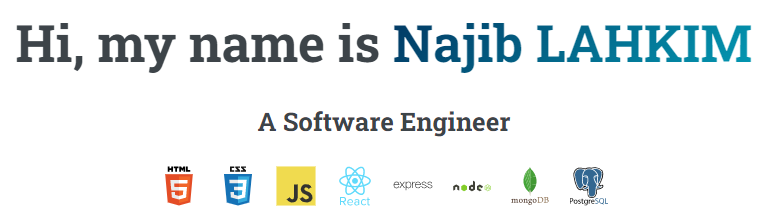
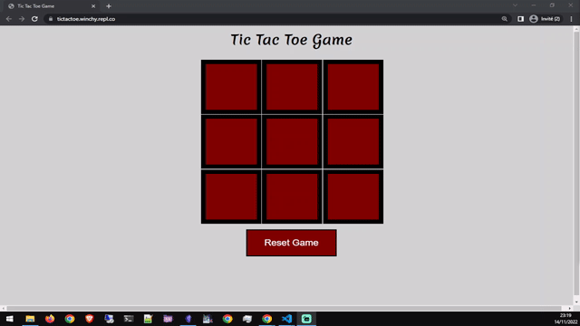

<h1 align="center">Hi 👋, I'm Najib LAHKIM</h1>
<h3 align="center">A passionate Digital Marketer and Full Stack developer from Morocco</h3>

  

- 🔭 I’m currently working on **my 100 hours project**

- 🌱 I’m currently learning **React & node.Js**

- 👯 I’m looking to collaborate on **API related projects**

- 🤝 I’m looking for help with **Making a Front end to a TV API**

- 👨‍💻 All of my projects are available at [here](portfolioLink)

<!-- - 📝 I regularly write articles on [blogLink](blogLink) -->

- 💬 Ask me about **js/node.js, python/flask, lua/love2d, c#/monogame**

- 📫 How to reach me **nlahkim@pm.me**

- 📄 Know about my experiences [ResumeLink](ResumeLink)

- ⚡ Fun fact **I love to learn how things works, and codng allows to do magic.**

---

&nbsp;

---
<h2 align="center">Projects</h1>

All my projects are available here on GitHub. You can view my top projects/contributions pinned below this introduction, or you can browse my repositories to see what I have built.
Not everything I build is open-source, There is property porjects that belong their respective owners.
Feel free to look at the repositories and play around with the code.
If you ever discover a bug or want to request a feature, please submit an issue or a pull request — they are always welcome! 

<table bordercolor="#66b2b2" width="100%" >
  <tr>
    <td width="50%" valign="top">
      <h3 align="center">Restaurant Website</h3>
         
        
         
        
    
    
  
      

         
<strong>HTML5, CSS3, & Javascript</strong>

    </td>
    <td width="50%" valign="top">
      <h3 align="center">Hair Salon Website</h3>
         
      
         
        
   
  
  
      

      
<strong>HTML5, CSS3, & Javascript</strong>

    </td>
  </tr>
  <tr>
    <td width="50%" valign="top">
      <h3 align="center">My Portfolio</h3>
       
        
       
        

  
  
      

        
<strong>HTML5, CSS3, & Javascript</strong>

    </td>
    <td width="50%" valign="top">
      <h3 align="center">Tic Tac Toe</h3>
         
        
         
        
 
  
  
      

        
<strong>HTML5, CSS3, & Javascript</strong>

    </td>
  </tr>
</table>

---

## Languages and Tools:

### Web Technologies:

  
  

### Programming Languages:

  
 
   

### Frontend Development:

  
  

### Backend Development:

  
  
  

### Mobile App Development:

  
  
  

### Database:

  
  
  

### Devops:

  
  
  

### Software:

  
  
  
  
  

### Game Engines:

### Automation:

   
  

### Other:

  
  

